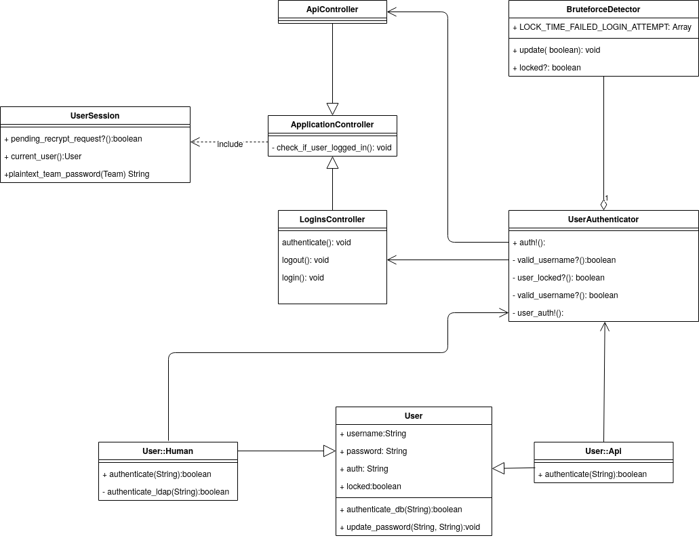
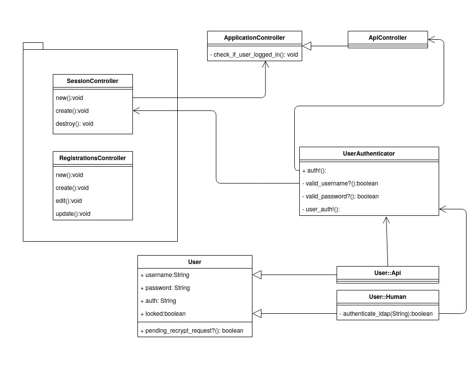

# Probe Ipa
##### Standardisierung Authentifizierung und Sessionmanagement Cryptopus - PoC

<!-- .slide: class="master01" -->

<!-- section -->

## Inhalt
- Einleitung
- Ist-Zustand
- Konzept
- Umsetzung
- Fazit
- Fragen

<!-- .slide: class="master03" -->
<!-- section -->

## Einleitung

- Cryptopus Passwortmanager von Puzzle
- Standardisierung der Authentifizierung
- "Proof of Concept" für Devise

<!-- .slide: class="master03" -->
<!-- section -->
## Ist-Zustand

<!-- .slide: class="master03" -->
<!-- slide -->

### Features

- Auto loggout nach 5 Minuten
- Bruteforcedetection
- Ip-Validierung und Ip-Tracking
- Datenbank Authentifizierung
- Ldap Authentifizierung
- Passwort Verwaltung(Datenbank)

<!-- .slide: class="master03" -->
<!-- slide -->
### Aufbau

  

<!-- .slide: class="master03" -->
<!-- section -->
## Konzept

<!-- .slide: class="master03" -->
<!-- slide -->

### Devise Aufbau

**Verwendete Module:**

- Database Authenticatable
- Recoverable
- Registerable
- Trackable
- Timeoutable
- Lockable

**Weitere Module:**
Omniauthable, Confirmable, Rememberable, Validatable
<!-- .slide: class="master03" -->
<!-- slide -->
## Variantenentscheid
**Database Authenticatable**

- SHA512 vs Bcrypt
- Standardisierung

<!-- .slide: class="master03" -->
<!-- slide -->
### Klassenkonzept

  

<!-- .slide: class="master03" -->
<!-- section -->
## Umsetzung

<!-- .slide: class="master03" -->
<!-- slide -->

## Basis

1. Gem ins Gemfile
1. Rails Tasks
1. Views erstellen
1. Routing anpassen
1. Before Actions abändern
1. Migration

<!-- .slide: class="master03" -->
<!-- slide -->

## Cryptopus spezifisch

- SessionsController anpassen
- RegistrationsController anpassen

<!-- .slide: class="master03" -->
<!-- slide -->

## Umgesetzt Features

- Login
- Bruteforcedetection
- Auto loggout
- Passwort ändern
- Loginmessages

<!-- .slide: class="master03" -->
<!-- slide -->

## Testing

- Manuelle Tests nach Protokoll
- Schönwetter-Tests

<!-- .slide: class="master03" -->
<!-- section -->
## Reflexion

- POC erfolgreich
- Hermes probleme
- Tests
- Homeoffice

<!-- .slide: class="master03" -->
<!-- section -->

# Fragen

<!-- .slide: class="master03" -->
<!-- section -->

# Vielen Dank!

<!-- .slide: class="master01" -->
